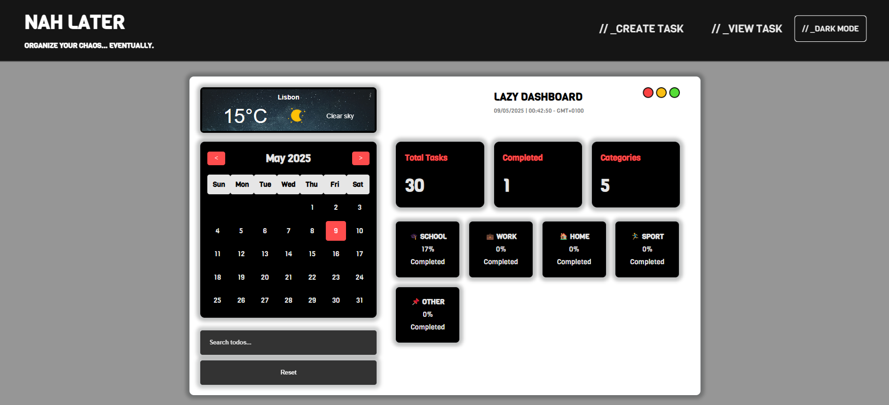
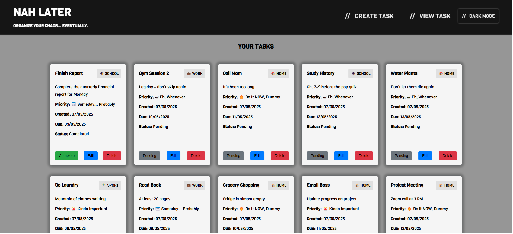
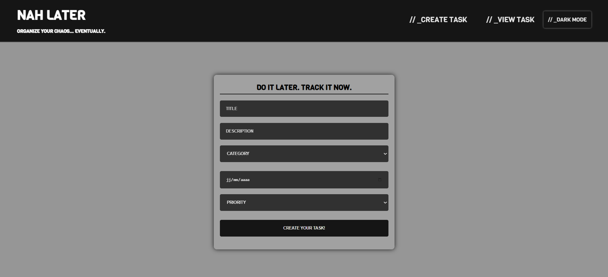

### **Titulo do website:** Nah Later 

 

### **Descrição do website:** Another ToDo List

 

### **Repositorio:** [/frontend1-project](https://github.com/Huniity/frontend1-project)

 

 

# Requisitos

1. Create, Read, Update and Delete operations (Create todo item, read all todo items, update single todo item, Delete single todo item). ✅\
    `Create - /scripts/create_task.js` `Read / Update / Delete - /scripts/todo_main.js` \
    [here](./scripts/create_task.js) - create_task.js  \
    [here](./scripts/todo_main.js) - todo_main.js
2. Use mock api. ✅ \
    `Mock API - /lib/mock_api.js` \
    [here](./lib/mock_api.js) - mock_api.js
3. Use at least one native javascript API (Geolocation, DateTime, etc). ✅ \
    `DateTime - /scripts/datetime.js` \
    [here](./scripts/datetime.js) - datetime.js
4. Form to create and edit todo items, with validation. ✅ \
    `Form - /create_task.html - /scripts/create_task.js | /index.html - /scripts/todo_main.js` \
    [here](./create_task.html) - create_task.html \
    [here](./scripts/create_task.js) - create_task.js \
    [here](./index.html) - index.html \
    [here](./scripts/todo_main.js) - todo_main.js
5. Use at least one external library (An ui component library for example). ✅ \
    `SweetAlert - /scripts/create_task.js` \
    [here](./scripts/create_task.js) - create_task.js
6. Responsive ✅ \
    `In Navigator Check` \
    [here](https://huniity.github.io/frontend1-project/) - GitHub WebPage
7. Generate lighthouse report with all 4 metrics on the green. ✅ \
    `File is on root` \
    [here](./lighthouse_mobile.pdf) - Mobile Report \
    [here](./lighthouse_pc.pdf) - PC Report
8. Online on github pages. ✅ \
    `In Navigator Check` \
    [here](https://huniity.github.io/frontend1-project/) - GitHub WebPage

## Bonus

- Implement 1 web component. ✅ \
    `Footer - shared_components.js` \
    [here](./scripts/shared_components.js) - shared_components.js
- Also use local storage. ✅ (For Dark Mode) \
    `Dark Mode - dark_mode.js` \
    [here](./scripts/dark_mode.js) - dark_mode.js
- Configure PWA. ✅ \
    `In Navigator/Mobile Check + service_worker.js` \
    [here](./scripts/service_worker.js) - Mobile Report \
    [here](https://huniity.github.io/frontend1-project/) - GitHub WebPage
- Use canvas in some way. ✅ \
    `3 Dot Canva - canvas.js` \
    [here](./scripts/canvas.js) - canvas.js
- Apresentar projeto no portfolio desenvolvido em Web Pages ✅ \
    `In Navigator Check` \
    [here](https://huniity.github.io/adrien_dev_portfolio/) - GitHub WebPage Portfolio